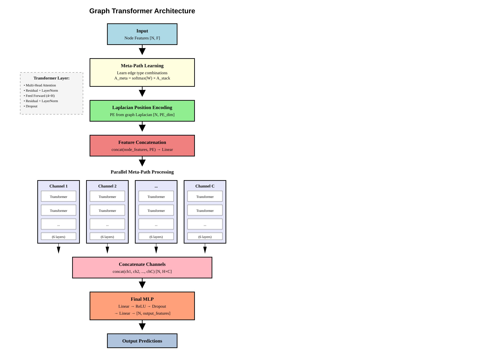

# Graph Transformer with Meta-Path Learning

<!-- [](https://www.python.org/downloads/)
[](https://pytorch.org/)
[](https://pytorch-geometric.readthedocs.io/)
[](LICENSE) -->

A state-of-the-art Graph Transformer architecture that combines **meta-path learning**, **Laplacian positional encoding**, and **multi-channel processing** for superior node classification performance on heterogeneous graphs.

## Key Features

- **Meta-Path Learning**: Automatically learns optimal combinations of edge types using learnable weights
- **Laplacian Positional Encoding**: Enriches node representations with structural position information
- **Multi-Channel Processing**: Parallel transformer processing across different meta-path channels
- **Scalable Architecture**: Efficient attention mechanisms with configurable depth and width
- **End-to-End Learning**: Differentiable meta-path discovery integrated with transformer layers

## Architecture Overview



### Core Components

1. **Meta-Path Learner**: Discovers meaningful edge type combinations
   ```
   A_meta = softmax(W) × A_stack
   ```

2. **Laplacian Positional Encoding**: Captures structural node positions
   ```
   PE = eigenvectors(L)[1:k]  # Skip zero eigenvalue
   ```

3. **Multi-Channel Transformer**: Parallel processing across meta-paths
   ```
   Output = MLP(concat(Channel_1, Channel_2, ..., Channel_C))
   ```

## Quick Start

### Installation

```bash
pip install torch torch-geometric scipy numpy
```

### Basic Usage
The usage is represented in [`node_classification.ipynb`](./node_classification.ipynb)


## Model Configuration

### Key Parameters

| Parameter | Default | Description |
|-----------|---------|-------------|
| `input_features` | - | Dimension of input node features |
| `hidden_features` | - | Hidden dimension for transformer layers |
| `output_features` | - | Number of output classes |
| `num_edge_types` | 3 | Number of different edge types in the graph |
| `num_metachannels` | 10 | Number of meta-path channels to learn |
| `num_layers` | 6 | Number of transformer layers per channel |
| `heads` | 4 | Number of attention heads |
| `dropout` | 0.1 | Dropout probability |
| `pos_enc_dim` | 32 | Dimension of Laplacian positional encoding |

### Architecture Variants

```python
# Lightweight model for small graphs
model_light = GraphTransformer(
    input_features=32, hidden_features=64, output_features=3,
    num_metachannels=5, num_layers=3, heads=2
)

# Heavy model for large, complex graphs
model_heavy = GraphTransformer(
    input_features=128, hidden_features=256, output_features=10,
    num_metachannels=20, num_layers=8, heads=8
)
```

## How It Works

### 1. Meta-Path Discovery
The model learns to combine different edge types using learnable weights:
- Each edge type contributes to multiple meta-path channels
- Softmax normalization ensures balanced contribution
- Gradient-based optimization discovers optimal combinations

### 2. Positional Encoding
Laplacian eigenvectors provide structural information:
- Captures global graph structure
- Helps distinguish nodes with similar features but different positions
- Computed once and cached for efficiency

### 3. Multi-Channel Processing
Parallel transformer streams process different meta-paths:
- Each channel focuses on a specific semantic relationship
- Independent attention mechanisms capture diverse patterns
- Final concatenation combines all learned representations

## Performance Benefits

- **Heterogeneous Graphs**: Excels on graphs with multiple edge types
- **Long-Range Dependencies**: Transformer architecture captures distant node relationships  
- **Structural Awareness**: Positional encoding improves structural understanding
- **Adaptive Learning**: Meta-path weights adapt to data characteristics
- **Scalability**: Efficient parallel processing across channels

## 🔬 Research Applications

Perfect for domains with rich relational structure:
- **Knowledge Graphs**: Entity classification with multiple relation types
- **Social Networks**: User categorization with various interaction types
- **Biological Networks**: Protein function prediction with diverse associations
- **Recommendation Systems**: Item classification with multi-modal relationships
- **Academic Networks**: Paper classification using citation, authorship, and topic links

## Advanced Usage

### Custom Meta-Path Learning

```python
# Access learned meta-path weights
_, _, attention_weights = model(node_features, edge_indices)
print(f"Meta-path attention shape: {attention_weights.shape}")  # [num_channels, num_edge_types]

# Visualize most important edge type combinations
top_channels = attention_weights.topk(k=3, dim=0)
print("Top meta-path combinations:")
for i, channel in enumerate(top_channels.indices.t()):
    print(f"Channel {i}: Edge types {channel.tolist()}")
```

### Custom Positional Encoding

```python
from graph_transformer import laplacian_position_encoding

# Generate custom positional encodings
pos_enc = laplacian_position_encoding(
    edge_index=combined_edges, 
    num_nodes=1000, 
    pos_enc_dim=64
)
print(f"Positional encoding shape: {pos_enc.shape}")  # [1000, 64]
```

## Citation

If you use this Graph Transformer in your research, please cite:
This work builds upon the foundational Graph Transformer architecture:

```bibtex
@article{dwivedi2020generalization,
  title={A Generalization of Transformer Networks to Graphs},
  author={Dwivedi, Vijay Prakash and Bresson, Xavier},
  journal={arXiv preprint arXiv:1911.06455},
  year={2019}
}
```

## Contributing

Contributions are welcome! Please feel free to submit a Pull Request. Areas for improvement:

- [ ] Add support for edge features
- [ ] Implement batch processing for multiple graphs
- [ ] Add more positional encoding variants
- [ ] Optimize memory usage for very large graphs
- [ ] Add comprehensive benchmarks

## License

This project is licensed under the MIT License - see the [LICENSE](LICENSE) file for details.

## Acknowledgments

- Built on top of [PyTorch Geometric](https://pytorch-geometric.readthedocs.io/)
- Inspired by recent advances in graph transformers and meta-path learning
- Thanks to the open-source community for valuable feedback and contributions

---

**Made with ❤️ for the graph learning community**